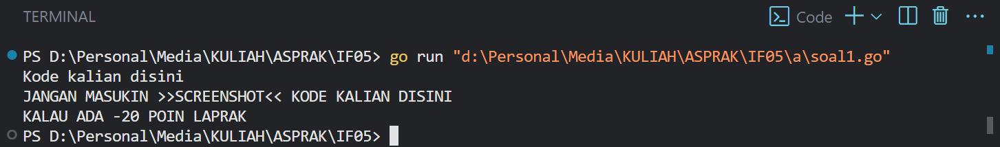
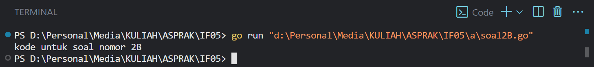

# <h1 align="center">Laporan Praktikum Modul X <br> Nama Modul</h1>
<p align="center">NAMA - NIM</p>

## Dasar Teori

yang panjang dikit

## Unguided

### soal 1

aku mengerjakan perulangan

## Unguided

### Soal 1

copy paste soal nomor 1 disini

```go
package main

func main() {
	fmt.Println("Kode kalian disini")
	fmt.Println("JANGAN MASUKIN >>SCREENSHOT<< KODE KALIAN DISINI")
	fmt.Println("KALAU ADA -20 POIN LAPRAK")
}
```

> Output
> 
> %% Untuk mencantumkan screenshot, tidak boleh ada spasi di urlnya `()`, penamaan file bebas asal gak sara dan mudah dipahami aja,, dan jangan lupa hapus komen ini yah%%

Penjelasan ttg kode kalian disini

### Soal 2

soal nomor 2A

```go
package main

func main() {
	fmt.Println("kode untuk soal nomor 2A")
}
```

> Output
> 

penjelasan kode

Kalau adalanjutan di lanjut disini aja

soal nomor 2B

```go
package main

func main() {
	fmt.Println("kode untuk soal nomor 2B")
}
```

> Output
> 

penjelasan bedanya sesuai soal

## Referensi

1. https://en.wikipedia.org/wiki/Data_structure (diakses blablabla)
